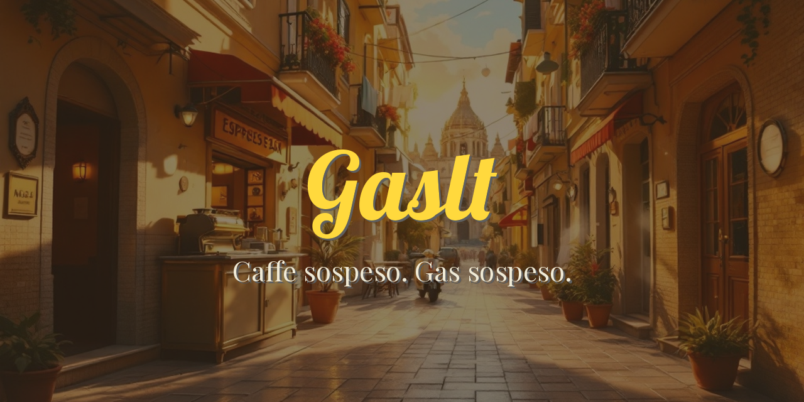
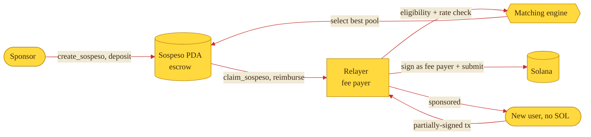

<p align="center">
  
</p>

<h1 align="center">gaslt</h1>

<p align="center"><strong>Caffe sospeso. Gas sospeso.</strong></p>

<p align="center">
  A reference implementation of the <strong>sospeso</strong> gas-abstraction protocol for Solana:
  sponsors pre-pay transaction fees into pools, and wallets that hold no SOL draw on them to transact.
</p>

<p align="center">
  <a href="https://gaslt.fun"></a>
  <a href="https://github.com/gaslt-fun/gaslt/tree/main/docs"></a>
  <a href="https://x.com/gasltbar"></a>
</p>

<p align="center">
  <a href="https://github.com/gaslt-fun/gaslt/actions/workflows/ci.yml"></a>
  <a href="./LICENSE"></a>
  <a href="https://github.com/gaslt-fun/gaslt/stargazers"></a>
  
  
  
</p>

---

## What is a sospeso

A *caffe sospeso* is a coffee paid in advance for a stranger who cannot afford
one -- a small kindness left waiting at the bar. The sospeso protocol applies the
same idea to gas: a **sponsor** deposits lamports into a pool, and a **relayer**
becomes the fee payer for a new user's transaction (the Octane pattern),
reimbursing itself from a matched pool. A SOL-less wallet can transact from its
very first action, and the sponsor's gift is spent safely under on-chain rules.

| Concept | Meaning |
|---------|---------|
| Sospeso | A pool of lamports a sponsor pre-paid for others to use as gas. |
| Sponsor | Funds a pool; can top it up or reclaim the remainder after expiry. |
| Beneficiary | A wallet that needs gas and signs the transaction it wants run. |
| Relayer | Pays the network fee and reimburses itself from a matched pool. |
| Verifier | The on-chain program that holds escrow and enforces claim rules. |

## Architecture



The decision rules -- escrow accounting, claim verification, eligibility, rate
limiting, and matching -- live in a single chain-agnostic Rust crate so the
exact same logic runs on-chain, in the relayer, and in clients. See
[`docs/architecture.md`](./docs/architecture.md) for the module graph.

## Repository layout

```
gaslt/
├── crates/
│   └── gaslt-core/            Chain-agnostic protocol logic (Rust)
│       └── src/
│           ├── types.rs       Pubkey, SospesoParams, Sospeso
│           ├── escrow.rs      Checked lamport accounting + rent floor
│           ├── claim.rs       Claim verification and receipts
│           ├── eligibility.rs New-wallet gating and program matching
│           ├── rate.rs        Fixed-window rate limiting
│           ├── registry.rs    In-memory pools and receipts
│           └── matching.rs    Best-pool selection
├── programs/
│   └── sospeso-verifier/      On-chain Anchor program
├── sdk/                       TypeScript client (@gaslt/sdk)
└── docs/                      Protocol and architecture notes
```

## Features

- **Escrow with a protected rent floor.** Every debit is checked; a pool can
  never be drawn below the rent-exempt threshold that keeps its account alive.
- **Double-claim guard.** A receipt is keyed on `(pool, beneficiary)`; a second
  claim by the same wallet from the same pool fails at receipt creation.
- **Matching engine.** Selects the smallest remaining budget that still covers a
  request -- spend the change jar before the big fund -- with a nearest-expiry
  tie-break.
- **Layered anti-abuse.** New-wallet gating (fail-closed on unverifiable
  wallets) plus fixed-window rate limits across ip / wallet / pool axes.
- **One source of truth.** The rules are pure functions, so the relayer can
  pre-check off-chain and predict the exact on-chain rejection reason.

## Quickstart

Drive a pool end to end with the core crate:

```rust
use gaslt_core::prelude::*;

let mut registry = Registry::new();

// A sponsor opens a new-wallet-only onboarding pool.
let sponsor = Pubkey::from_bytes([1u8; 32]);
