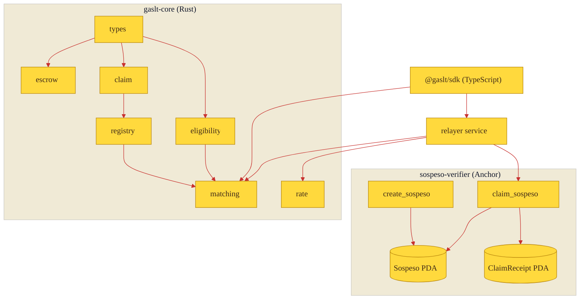

# Architecture

The protocol is split into a chain-agnostic core, an on-chain program, and a
client SDK. The core holds every decision rule as a pure function so the same
logic is reused on-chain, in the relayer service, and in clients.

## Modules

| Module | Purpose |
|--------|---------|
| `types` | Addresses, pool parameters, and the `Sospeso` record. |
| `escrow` | Checked lamport accounting with a protected rent floor. |
| `claim` | Claim verification and the receipt it produces. |
| `eligibility` | New-wallet gating and program matching. |
| `rate` | Fixed-window rate limiting across ip / wallet / pool axes. |
| `registry` | In-memory store of pools and receipts. |
| `matching` | Selecting the best eligible pool for a beneficiary. |

## Why a separate core

Solana programs are compiled for a constrained target and are awkward to unit
test exhaustively. By keeping the rules in a plain Rust library that takes time
and wallet metadata as inputs, the same code path that runs on-chain is covered
by fast host tests, and the relayer can run an identical pre-check before
spending a fee.
