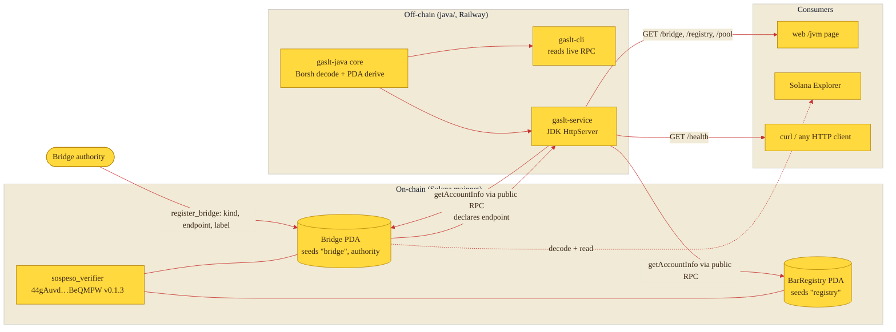
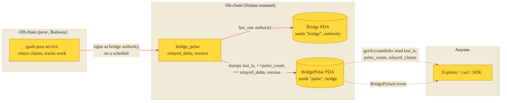

# The JVM bridge

The sospeso program runs on Solana, but the toolkit that reads it is polyglot:
alongside the Rust core and the TypeScript SDK there is a JVM toolkit under
[`java/`](../java). To make that integration *verifiable from either side*, the
program carries an on-chain `Bridge` account: a small record an authority
registers to declare the canonical off-chain endpoint that serves the program's
state. Anyone can read the `Bridge` on chain and confirm it points at the live
Java service, and the service decodes the very same account to confirm it is the
endpoint the chain advertises.

There is exactly one live bridge today: the `gaslt-java` HTTP service, kind
`jvm`, running at `https://gaslt-jvm.up.railway.app`.

## How the two sides connect



The authority writes the endpoint on chain once (`register_bridge`); from then on
the service reads that account back through a public RPC and re-serves it, so the
on-chain declaration and the off-chain response can be cross-checked against each
other without any private index.

## The `Bridge` account

A `Bridge` is a PDA at seeds `["bridge", authority]` — one bridge per authority.
It is created by `register_bridge`, edited by `update_bridge`, and closed (rent
refunded to the authority) by `revoke_bridge`; only the recorded `authority` may
write to it. Every field is a fixed-width primitive or null-padded ascii byte
array, so the 282-byte account has a constant layout that the Java service reads
by offset rather than with a string-length parser.

| Offset | Size | Field | Type | Notes |
|-------:|-----:|-------|------|-------|
| 0 | 8 | discriminator | `[u8; 8]` | `sha256("account:Bridge")[..8]` = `e7e81f626e03173b` |
| 8 | 32 | `authority` | `Pubkey` | The only writer of this bridge. |
| 40 | 16 | `kind` | `[u8; 16]` | Ascii, null-padded (e.g. `jvm`). |
| 56 | 160 | `endpoint` | `[u8; 160]` | Off-chain service URI, ascii, null-padded. |
| 216 | 48 | `label` | `[u8; 48]` | Human-readable label, ascii, null-padded. |
| 264 | 1 | `enabled` | `bool` | `0` / `1`; whether the bridge is advertised live. |
| 265 | 8 | `registered_at` | `i64` | Unix timestamp, little-endian. |
| 273 | 8 | `updated_at` | `i64` | Unix timestamp of the last `update_bridge`. |
| 281 | 1 | `bump` | `u8` | PDA bump. |
| — | **282** | total | | 8 + 32 + 16 + 160 + 48 + 1 + 8 + 8 + 1. |

The instructions are additive: they neither read nor write any pool, receipt,
meta, or registry account, so every account created by earlier program versions
keeps deserializing unchanged.

## Bridge pulse — on-chain liveness oracle

A `Bridge` says *where* the off-chain service lives, but it cannot, on its own,
tell you whether that service is still running. The `bridge_pulse` instruction
closes that gap: it lets the bridge authority stamp a small heartbeat account so
that *liveness and cumulative work become readable from the chain alone*, with no
need to trust the service's own `/health` response.

Each pulse does three things in one transaction: records the current block
timestamp, folds a `relayed_delta` into a running total of claims the bridge has
relayed, and writes back the service's reported `version`. The first call creates
the account; every later call updates it in place. Only the bridge `authority`
may write it — the program enforces this with a `has_one = authority` constraint
against the bridge, so a pulse is cryptographic proof that the same key behind the
registered bridge is the one reporting the heartbeat.



### The `BridgePulse` account

A `BridgePulse` is a PDA at seeds `["pulse", bridge]` — one per bridge. Its
fields are all fixed-width, so the 101-byte account decodes by offset just like
the bridge it tracks.

| Offset | Size | Field | Type | Notes |
|-------:|-----:|-------|------|-------|
| 0 | 8 | discriminator | `[u8; 8]` | `sha256("account:BridgePulse")[..8]` = `b3c4355582814ed3` |
| 8 | 32 | `bridge` | `Pubkey` | The bridge this pulse belongs to. |
| 40 | 32 | `authority` | `Pubkey` | The bridge authority that stamps it. |
| 72 | 8 | `last_ts` | `i64` | Unix timestamp of the most recent pulse, little-endian. |
| 80 | 8 | `pulse_count` | `u64` | Total pulses recorded since creation. |
| 88 | 8 | `relayed_claims` | `u64` | Cumulative claims the bridge reports relaying. |
| 96 | 4 | `version` | `u32` | Service-reported version on the latest pulse. |
| 100 | 1 | `bump` | `u8` | PDA bump. |
| — | **101** | total | | 8 + 32 + 32 + 8 + 8 + 8 + 4 + 1. |

Every successful pulse also emits a `BridgePulsed` event carrying the same
counters, so an indexer can follow bridge liveness from the transaction log
without an account read. Like the bridge instructions, `bridge_pulse` is purely
additive — it only reads the existing `Bridge` (never mutates it) and writes its
own dedicated account, so all earlier accounts keep deserializing unchanged.

A consumer interprets the pulse the obvious way: compare `last_ts` against the
current time to judge freshness, and read `relayed_claims` for how much work the
bridge has settled. Because the value is on chain, the judgement needs no trust
in the service that wrote it. From the Java core:

```java
SospesoClient client = new SospesoClient("https://api.mainnet-beta.solana.com");
PublicKey bridge = Pda.bridge(authority).getAddress();
client.fetchBridgePulse(bridge).ifPresent(p ->
        System.out.printf("last pulse %d, %d pulses, %d relayed%n",
                p.lastTs(), p.pulseCount(), p.relayedClaims()));
```

## The live bridge

The single registered bridge points the program at the `gaslt-java` service.
Every value below is readable on chain and reproducible from the table above.

| Field | Value |
|-------|-------|
| Bridge PDA | `B4smUxyDeW6ptTS6Sd5GsnRD2Pxm2acps5Fqo6HTmEsj` |
| Authority | `9prpwEhLBsN2V9JmGbryyxmsT87d2Hqc4UhqQG8zWtum` |
| Program | `44gAuvd36LqRNNMqDMCvmoJFNm3eoEGGyaHWeyBeQMPW` (v0.1.3) |
| `kind` | `jvm` |
| `endpoint` | `https://gaslt-jvm.up.railway.app` |
| `label` | `gaslt-java` |
| `enabled` | `true` |

The bridge address is never hard-coded into the SDK — it is derived from the
authority via `["bridge", authority]`. The pinned derivation (and bump `255`) is
covered by `BridgeRegistryTest` in the Java core.

## The off-chain service

The service is a single dependency-free `java/service` module built on the JDK's
`com.sun.net.httpserver.HttpServer`. It reads on-chain state through a public
mainnet RPC (`https://api.mainnet-beta.solana.com`, no API key) and returns JSON.

| Route | Returns |
|-------|---------|
| `GET /health` | Liveness plus which program and RPC this instance reads. |
| `GET /pool/{address}` | A decoded `Sospeso` pool account. |
| `GET /registry` | The singleton `BarRegistry` aggregate. |
| `GET /bridge/{authority}` | Derives `["bridge", authority]` and decodes the `Bridge`. |

## Reproduce it

Read the bridge straight from the chain with the CLI (offline PDA derivation,
then a live RPC read):

```bash
java -jar java/cli/target/gaslt-cli.jar \
  bridge 9prpwEhLBsN2V9JmGbryyxmsT87d2Hqc4UhqQG8zWtum
```

```text
bridge for authority 9prpwEhLBsN2V9JmGbryyxmsT87d2Hqc4UhqQG8zWtum
  bridge PDA : B4smUxyDeW6ptTS6Sd5GsnRD2Pxm2acps5Fqo6HTmEsj  (seeds ["bridge", authority])
  kind       : jvm
  endpoint   : https://gaslt-jvm.up.railway.app
  label      : gaslt-java
  enabled    : true
```

Hit the live service the bridge points at:

```bash
curl https://gaslt-jvm.up.railway.app/health
curl https://gaslt-jvm.up.railway.app/bridge/9prpwEhLBsN2V9JmGbryyxmsT87d2Hqc4UhqQG8zWtum
```

```json
{"status":"ok","service":"gaslt-service","version":"0.1.3","program":"44gAuvd36LqRNNMqDMCvmoJFNm3eoEGGyaHWeyBeQMPW","rpc":"https://api.mainnet-beta.solana.com"}
{"authority":"9prpwEhLBsN2V9JmGbryyxmsT87d2Hqc4UhqQG8zWtum","bridgePda":"B4smUxyDeW6ptTS6Sd5GsnRD2Pxm2acps5Fqo6HTmEsj","kind":"jvm","endpoint":"https://gaslt-jvm.up.railway.app","label":"gaslt-java","enabled":true}
```

The `endpoint` you read on chain and the host you curl are the same string —
that is the whole point of the bridge.

You can also open the bridge account in a block explorer:
`https://explorer.solana.com/address/B4smUxyDeW6ptTS6Sd5GsnRD2Pxm2acps5Fqo6HTmEsj`.

## Current state, honestly

The registry and bridge are live; the pool side is empty. As served by
`GET /registry`, the `BarRegistry` is initialised but holds no pools yet:

```json
{"registryPda":"6s2rvrg8ytn3mRJJGX6cgZfgDGMMeokC9cD7pJ4v82bm","authority":"9prpwEhLBsN2V9JmGbryyxmsT87d2Hqc4UhqQG8zWtum","totalPools":0,"totalClaims":0,"totalSuspendedLamports":"0"}
```

So `totalPools` is `0` and no sospeso pool has been created on chain yet —
`GET /pool/{address}` will return `pool_not_found` for any address until a
sponsor opens one. What is provably live today is the program, the initialised
registry, and this JVM bridge.
